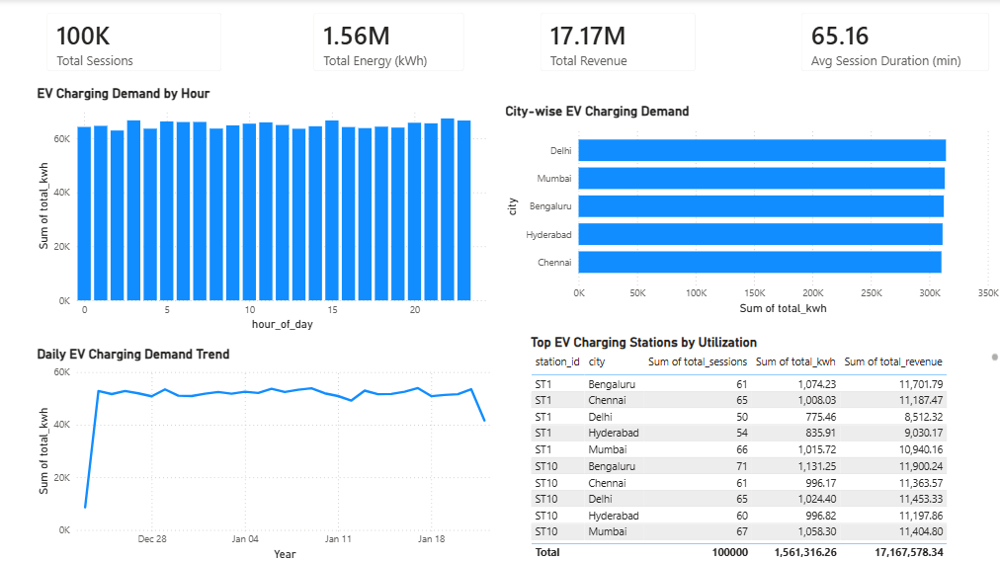

# EV Charging Demand Analytics Platform

End-to-end EV charging demand analytics pipeline using Python, SQL Server, AWS S3, Excel, and Power BI.


##  Project Overview

This project is an end-to-end data analytics pipeline that analyzes electric vehicle (EV) charging demand patterns across major Indian cities using session-level telemetry data.

The pipeline demonstrates a complete analytics workflow using Python for ETL, SQL Server for data warehousing, Excel for data quality validation, AWS S3 as a data lake, and Power BI for visualization.

---

##  Business Objective

To understand how EV charging demand varies by time, location, and station usage in order to support infrastructure planning and operational decision-making.

Key questions answered:

- What are the peak EV charging hours?
- Which cities have the highest charging demand?
- How is charging demand trending daily?
- Which charging stations are most utilized?

---

##  Data Model


**Fact Table:**

`fact_charging_sessions`

| Column        | Description                     |
|---------------|---------------------------------|
| session_id    | Unique charging session ID      |
| station_id    | Charging station identifier     |
| city          | City name                       |
| start_time    | Session start timestamp         |
| end_time      | Session end timestamp           |
| duration_min  | Session duration in minutes     |
| energy_kwh    | Energy consumed (kWh)           |
| cost          | Charging cost                   |
| vehicle_type  | Vehicle category                |
| user_type     | Public or private user          |

---

##  Data Pipeline

1. **Data Generation (Python)**
   - Generated realistic EV charging session data.
   - Output: `ev_sessions_raw.csv`

2. **Data Cleaning & Transformation (Python)**
   - Parsed timestamps and derived session duration.
   - Enforced data quality rules.
   - Output: `ev_sessions_clean.csv`

3. **Data Lake (AWS S3)**
   - Raw zone: `ev_sessions_raw.csv`
   - Curated zone: `ev_sessions_clean.csv`

4. **Data Warehouse (SQL Server)**
   - Loaded curated data into `fact_charging_sessions`.
   - Created an analytics layer using SQL views.

5. **Analytics Layer (SQL Views)**
   - Peak charging hours
   - City-wise demand
   - Daily demand trend
   - Station utilization

6. **Data Quality & Reconciliation (Excel)**
   - Row count reconciliation across layers.
   - Metric reconciliation for energy and revenue.
   - Duplicate, null, and outlier checks.

7. **Visualization (Power BI)**
   - KPI cards for total sessions, energy, revenue, and average duration.
   - Hourly demand pattern.
   - City-wise demand.
   - Daily demand trend.
   - Station utilization table.

---

##  Tech Stack

- Python (Pandas, Faker)
- SQL Server
- Excel
- AWS S3
- Power BI

---

## Project Structure

```
ev_charging_analytics/
│   LICENSE
│   README.md
│
├── data_clean/
│   └── ev_sessions_clean.csv
│
├── data_raw/
│   └── ev_sessions_raw.csv
│
├── etl/
│   ├── clean_transform.py
│   └── generate_data.py
│
├── excel/
│   └── qa_checks.xlsx
│
├── images/
│   └── evDashboard.png
│
├── powerbi/
│   └── ev_dashboard.pbix
│
└── sql/
    ├── analytics_views.sql
    ├── create_tables.sql
    └── load_fact.sql


```

##  Key Insights

- EV charging demand is evenly distributed across hours in the simulated dataset.
- All five cities show similar total charging demand.
- Average session duration is approximately 65 minutes.
- Charging demand shows stable daily trends with minor variation.

---

##  Dashboard Preview

## Urban Mobility Dashboard


---

##  Author

Matthew Lawrence L  
Aspiring Data Analyst | Data Engineer | Data Scientist
